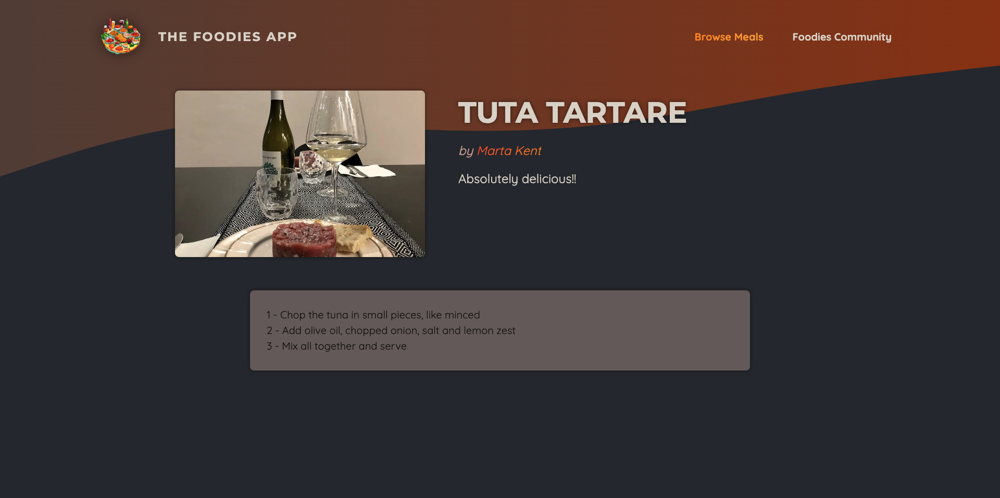

# The Foodies App

A full-stack application created with ReactJS and NextJS, using SQLite3 as database and S3 AWS for images storage, that allows users to view and share meals and recipes, as well as being part of a foodies community.




## Tech stack

**Frontend:**


**Backend:**


## Quickstart

### Set up your project

1. Fork this repository
2. Clone your fork to your local machine
3. Install Node.js dependencies

   ```bash
   npm install
   ```

4. Install an ESLint plugin for your editor (optional). For example: [`linter-eslint`](https://github.com/AtomLinter/linter-eslint) for Atom.

### Start the server

1. Start the server application

   ```bash
   npm run dev
   ```
